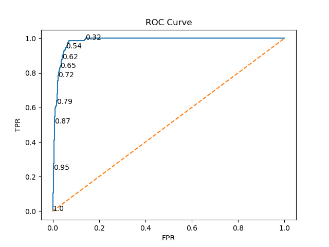
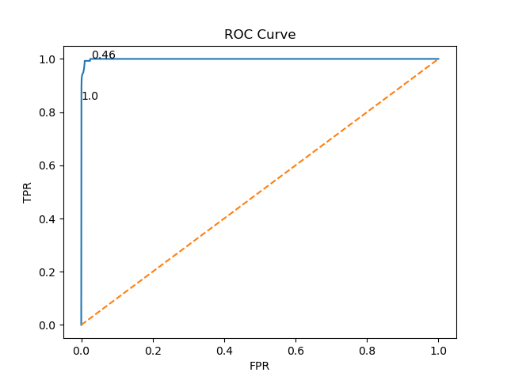
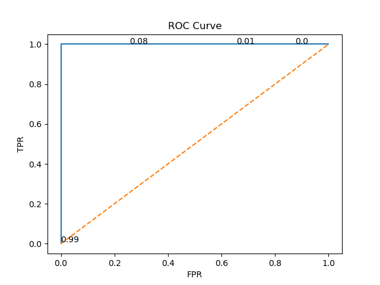
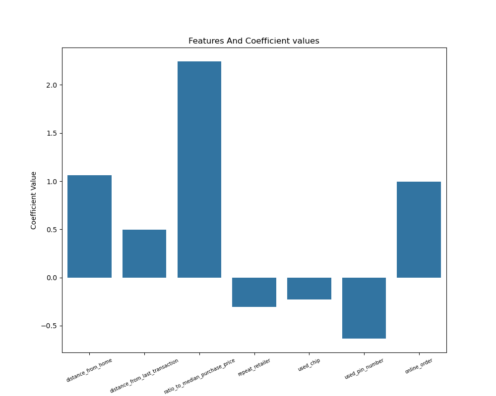
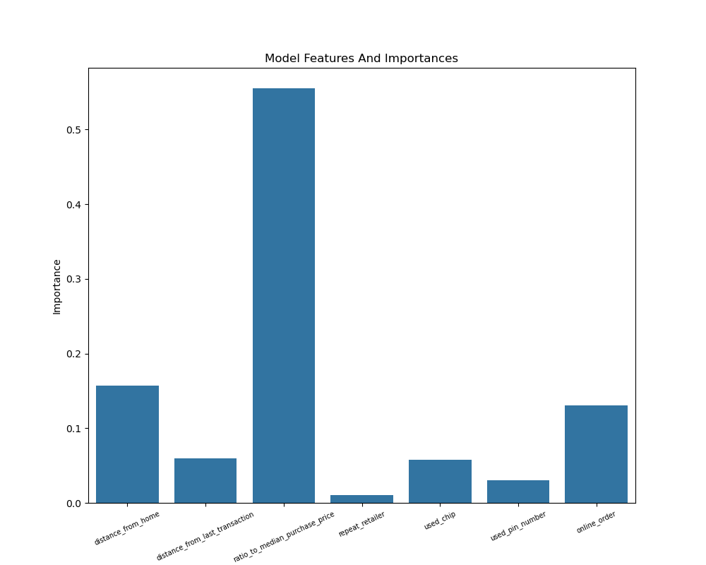
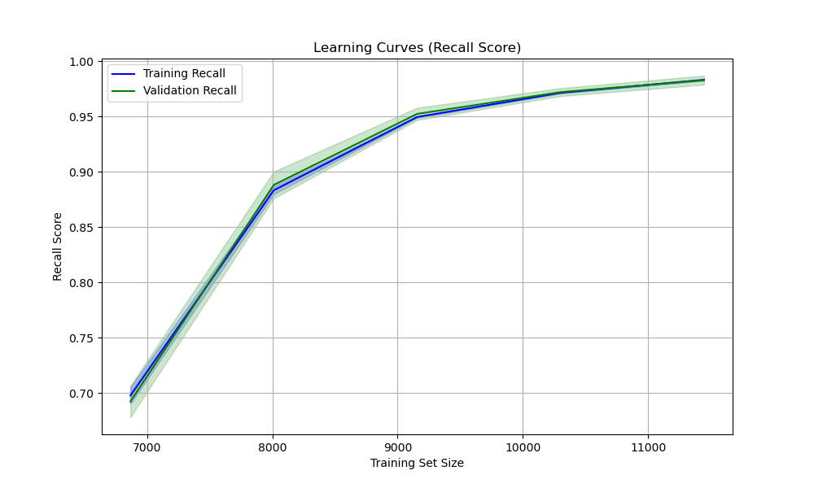
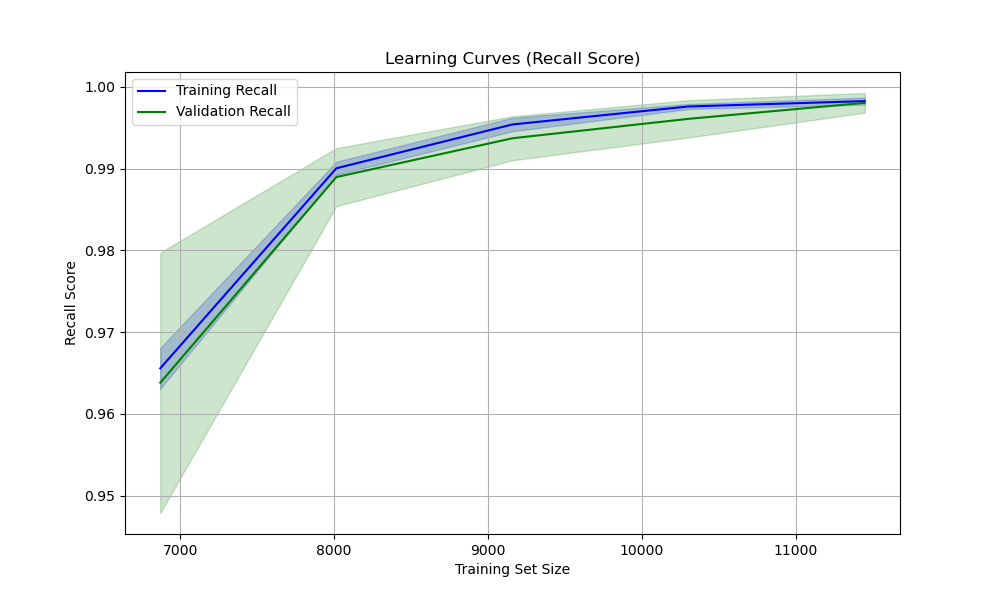
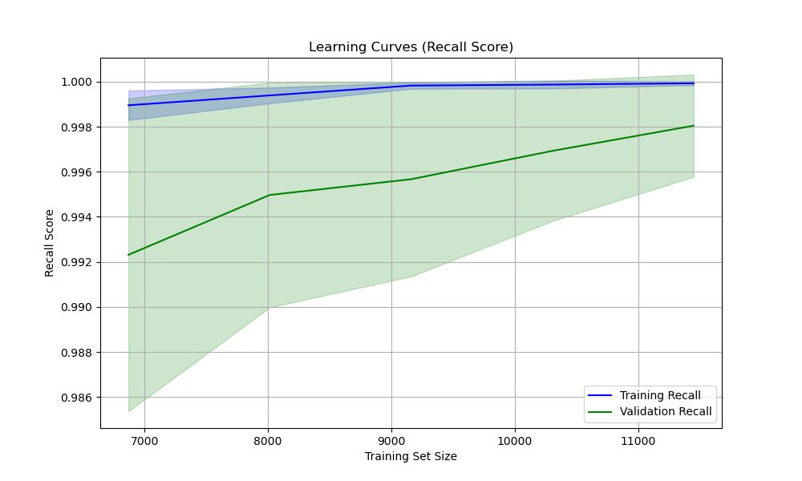

# Fraud-Analysis

# Introduction

Fraudulent activities in transactions are a critical challenge for financial institutions. Machine learning algorithms offer efficient methods for detecting fraudulent transactions. This project builds and evaluates three different machine learning models to classify transactions as fraudulent or non-fraudulent.
The main goals of the project are:
- To preprocess a dataset of transactions.
- To apply and evaluate the performance of Logistic Regression, K-Nearest Neighbors (KNN), and Random Forest models.
- To tune the hyperparameters of each model to obtain the best results.
- To identify the most effective model for fraud detection.

# Dataset

The dataset used in this project contains transaction records, each labeled as fraudulent (1) or non-fraudulent (0). Each record has several features such as:
- Distance from home
- Distance from last transaction
- Ratio to median purchase price
- Repeat retailer
- Used chip
- Used pin number
- Online order

The dataset can be found at - https://www.kaggle.com/datasets/dhanushnarayananr/credit-card-fraud/data

# Methodology

# 1. Preprocessing
The dataset was cleaned and preprocessed to handle:
- Influential outliers
- Reducing the size of the dataset, to reduce the time to train the model
- Oversampling (using SMOTE to balance the number of fraudulent and non-fraudulent transactions in the training data)
- Scaling numerical features (using standard scaler for logistic regression and KNN model)

# 2. Models
The following models are trained and evaluated:
- Logistic Regression: A linear model for classification
- K-Nearest Neighbours (KNN): A distance based algorithm for classification
- Random forest: An ensemble method using decision trees for classification

# 3. Evaluation metrics
The models are evaluated using:
- Accuracy: Fraction of correctly classified samples.
- Precision: Fraction of true positives among predicted positives.
- Recall: Fraction of true positives among actual positives.
- F1-Score: Harmonic mean of Precision and Recall.
- Confusion matrix - Showing all points classified as either true negative, false positive, false negative and true positive.
- ROC-AUC: Area under the Receiver Operating Characteristic curve.

# Installation

- Clone the repostiory using:
  git clone https://github.com/AdamBartlett7/Ford-Cars-Regression-Model.git
- Navigate to the correct directory using:
  cd Ford-Cars-Regression-Model
- To create your own virtual environment with the necessary python libraries use:
  conda env create -f environment.yml
- Open and run the files.

# Usage 

- Run fraud_cleaning.ipynb in sequential order to see the cleaning of the dataset and some visualisations on the features.
- Run fraud_log_reg.ipynb in sequential order to see how logistic regression model was created and performed also how the hyperparameters were tuned.
- Run fraud_knn.ipynb in sequential order to see how KNN model was created and performed also how the number for k was optimised.
- Run fraud_rf.ipynb in sequential order to see how random forest model was created and performed also how the hyperparameters were tuned.

# Results

 | Model               |   Accuracy  |   Precision  |   Recall   |     F1    |    ROC-AUC   | 
 | ------------------- | ----------- | ------------ | ---------- | --------- | ------------ |
 | Logistic Regression |    93.6%    |     52.2%    |    97.8%   |   68.1%   |     98.3%    |
 | KNN                 |    97.7%    |     75.1%    |    100%    |   85.8%   |     99.9%    |
 | Random Forest       |    99.9%    |     100%     |    98.5%   |   99.3%   |     99.9%    |

- Both the KNN and random forest model perform well with the KNN model achieving perfect recall, which is the most import evaluation metric for this classification problem.
- The random forest model is much more consistent scoring well in every evaluation metric.

# ROC Curve

- To evaluate the performance of the models, I plotted the ROC curves for all three models. The ROC curve illustrates the trade-off between True Positive Rate and False 
  Positive Rate, helping us assess the discriminatory power of each model. A higher Area Under the Curve (AUC) indicates better model performance.
# Logistic Regression ROC Curve
  
# KNN ROC Curve
  
# Random Forest ROC Curve
  
- From these visualisations we can see that all the models perform very well, but from the results table we can see the ROC-AUC score for both the KNN and Random Forest 
  models is tied for being the best.

# Confusion Matrix

   | Log Reg   | Predicted Not Fraud | Predicted Fraud |
   | --------- | ------------------- | --------------- |
   | Not Fraud |         1670        |       120       |
   | Fraud     |           3         |       131       |

   | KNN       | Predicted Not Fraud | Predicted Fraud |
   | --------- | ------------------- | --------------- |
   | Not Fraud |         1743        |        45       |
   | Fraud     |           0         |       136       |

   | RF        | Predicted Not Fraud | Predicted Fraud |
   | --------- | ------------------- | --------------- |
   | Not Fraud |         1788        |         0       |
   | Fraud     |           2         |       134       |

 - We can see that the random forest model has performed the best in terms of the confusion matrix only getting two incorrect predictions.
 - While the logistic regression model has performed the worst getting 123 incorrect predictions.

# Feature Coefficients & Feature Importance

- To understand the contribution of each feature to our models, I analyzed the feature coefficients from the Logistic Regression model and the feature importances from 
  the Random Forest model.
- The plot below shows the learned coefficients from our Logistic Regression model. Positive values indicate a positive association with a fraudulent transaction, while 
  negative values indicate a negative association.
  
- The plot below illustrates the feature importances assigned by our Random Forest model. Higher values indicate greater importance in making predictions.
  

# Learning Curve

- To assess how well the models learn from data and generalize to unseen samples, I plotted learning curves for each model. These curves show the relationship between 
  training and validation performance as the number of training samples increases. Learning curves are very important as it will help to diagnose any machine learning 
  problems. Such as the model underfitting or overfitting the data.
  
# Logistic Regression Learning Curve
  
  From this learning curve we can see that model struggles to generalize and performs not great on both training and validation sets. As more training data is added, the 
  model learns meaningful patterns, leading to improved performance on both sets. The fact that both curves increase at a similar rate suggests that the model is not 
  overfitting but is effectively learning from the data. As the curve hasn't completely plateaued some additional data could help boost the recall score closer to 
  perfect. 

# KNN Learning Curve
  
  This learning curve is very similar in shape to the logistic regression learning curve. However we can see that the initial recall score is already very high. As the 
  training size increases so does both the training and validation scores. Again as both curves are very close is suggests that model is not overfitting. Both curves have 
  plateaued at the end suggesting the model has slowed down it's learning. Again some additional data may help boost the recall score to perfect.

# Random Forest Learning Curve
  
  From this learning curve we can see that the model quickly learns the data and this is reflected in the high training and validation scores. The gradual increase in 
  validation scores shows that the additional training data is effectively improving the model on unseen data. The slight gap between the curves at the end could indicate 
  that the model requires some more training data or new features to converge. Or that the model suffers from a small overfitting problem but given the difference in 
  recall score between the lines I doubt it.

# License
- This project is licensed under the MIT License.
  
